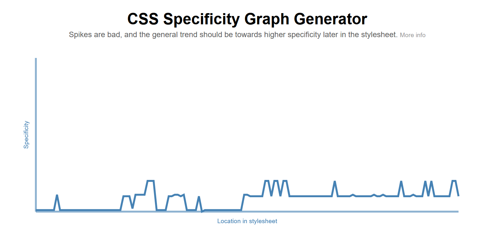

## Robotics :robot:

Robotics is a layout project using HTML5, CSS3, and the CSS **Sass preprocessor**. Also, the curious thing about this project is the **CSS architecture** that has been used. Keep reading!


## General info

Robotics was born from the fusion of learning on different platforms, specially on https://codely.tv (thank you so much!) . Basically, what has been done is to choose a pre-designed layout and transform it into code in a dynamic, reusable and, above all, maintainable way.

Thus, I would like to highlight two of the tools used:

- **Sass**: Saas has been used for the stylesheet, specifically with the SCSS syntax. It is a CSS preprocessor that adds very powerful functionalities to conventional CSS. It allows, among other things, the use of variables or nested CSS rules. Therefore, a much more scalable code can be built, which facilitates its maintenance, as well as cooperative work.
- **Atomic and ITCSS CSS architecture**: Atomic Design consists of organizing the different components into semantic classes dividing them into <u>atoms</u> (indivisible units, such as buttons, inputs or labels), <u>molecules</u> (simple components, such as cards), and <u>organisms</u> (defined parts of a page, such as a section or a footer). This organization system can be combined with the ITCSS (Inverted Triangle architecture for CSS) architecture, which divides the components into settings (ex: variables), tools (ex: mixins and functions), generic (ex: normalize), elements (ex: tags styles), objects (ex: classes and layout), components and utilities (ex: utilities that overwrite significant styles like an error block). 

In our case, we have replaced the "components" part with the three elements of the Atomic Design (atoms, molecules and organisms).

The **BEM** (Block, Element and Modifier) methodology has also been used to make the code more organized. It basically consists of treating the components as independent <u>blocks</u> (list), the internal elements of the block that depend on it and that have no semantic meaning standalone as <u>elements</u> (list__item) and the possible variations of each one as <u>modifiers</u> (list list--bold).


## Installation

To run this project

```
npm install

# To watch scss files
npm run watch
```


## Extra

In the Codely course they deal with the **CSS Specificity Graph Generator** tool, which is basically a very simple model to evaluate the level of specificity of a project's CSS. A specificity graph that has an upward trend represents that it is written in order of specificity. 

Taking advantage of this knowledge, I have passed my CSS through this tool and this has been the result:




For now, we can see that it is quite correct since in the first part of the graph the level of specificity is kept very low, then it rises by adding elements with classes and it remains at a fairly uniform level. It should be borne in mind that it is a simple landing page, without navigation (<u>and with the responsive in process</u>). Anyway, I think it may be a good place to start. Any suggestion, you can contact me on [Linkedin](https://www.linkedin.com/in/marcurto/). I would be very grateful!# Robotics
